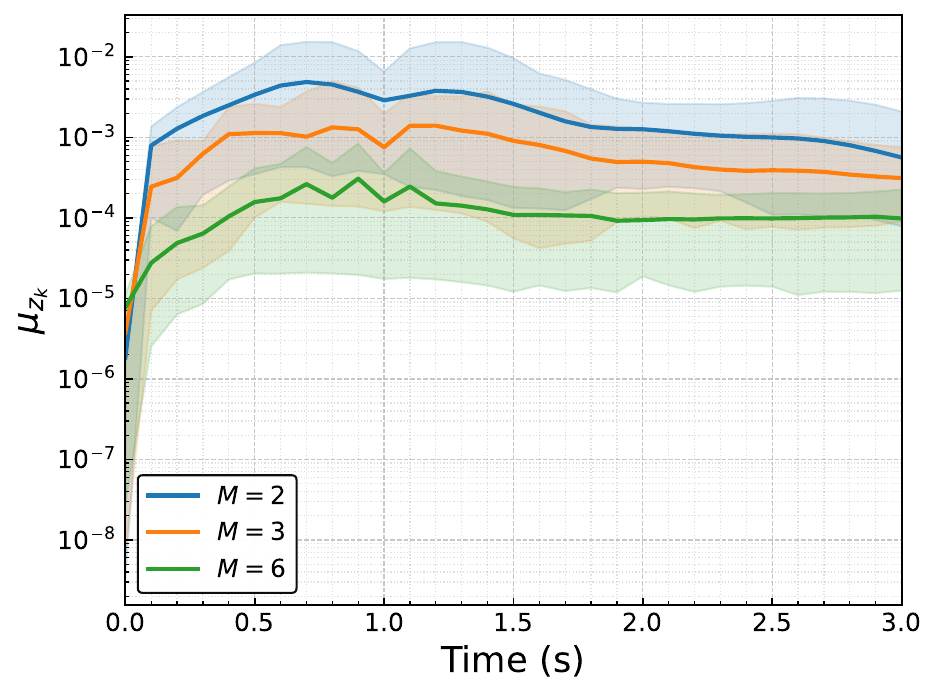
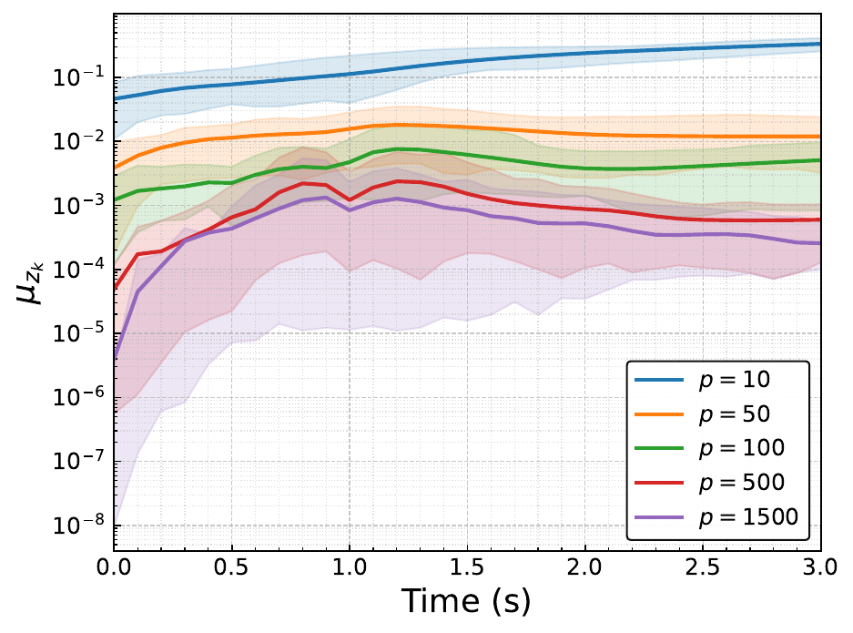
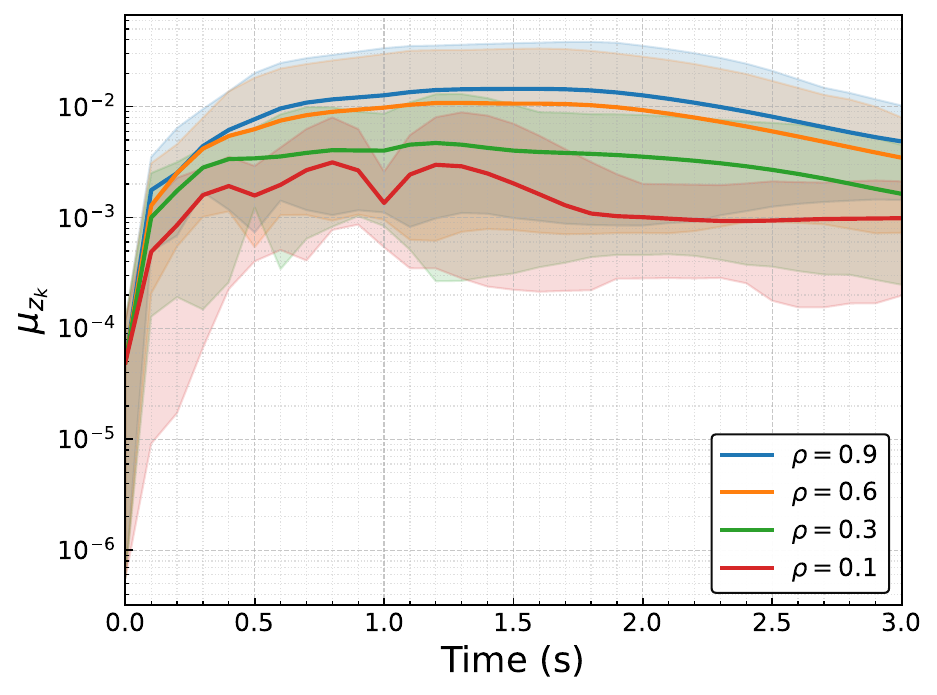
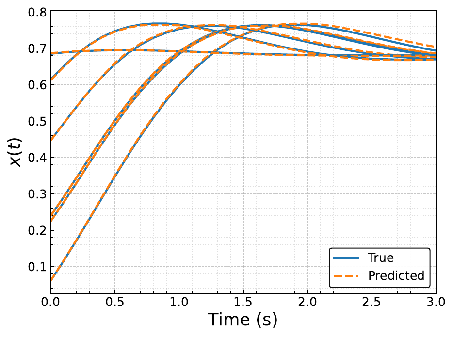
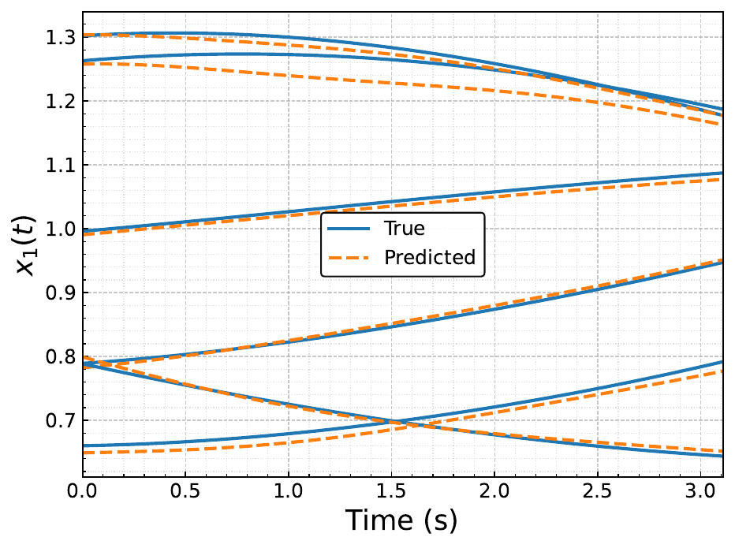
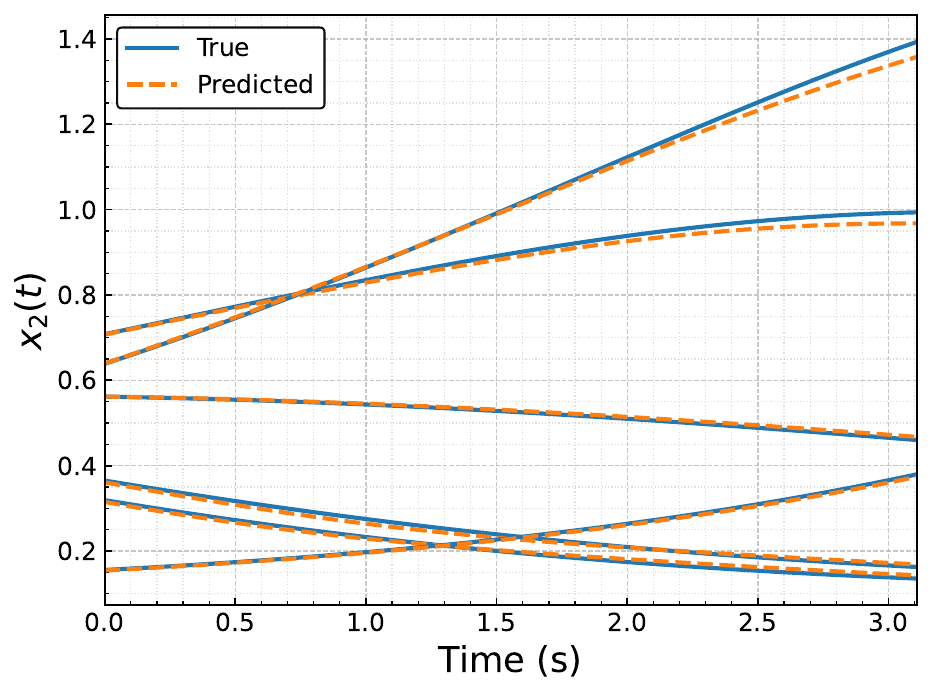

### 🌀 ⏱️ **kEDMD-DDE: Koopman Representations of Nonlinear Delay Differential Equations**

 🚀 **A data-driven Koopman surrogate for nonlinear DDEs, with deterministic, interpretable error bounds instead of heuristic delay embeddings.**

 ⚡ GPU-accelerated kEDMD • ✅ Provable error decomposition • 🔧 Ships with data

[](https://arxiv.org/abs/2604.03086)
[](LICENSE)
[]()
[]()
[]()

<h4><code>kedmd_dde</code> — A <b>self-contained PyTorch package</b> for <b>kernel extended dynamic mode decomposition (kEDMD)</b> on <b>delay differential equations</b>. Built on <b>history discretization + reconstruction</b>, so an infinite-dimensional delay system becomes a <b>finite-dimensional linear surrogate</b> with <b>explicit error guarantees</b>.</h4>

<p align="center">
  <a href="https://github.com/santoshrajkumar/koopman-dde-kEDMD">
    
  </a>
</p>

<p align="center">
  ✅ Deterministic bounds: discretization + interpolation + regression, separately
  ✅ Runs on GPU or CPU with no change to the calling code
  ✅ Datasets ship inside the wheel — every figure reproduces from a bare checkout
</p>


## 🌟 Key Features

✅ **Finite-dimensional Koopman realization for DDEs**


✅ **Deterministic error guarantees**


✅ **kEDMD with Wendland RBF kernels**


✅ **State reconstruction from lifted coordinates**


✅ **GPU-first, CPU-fine**


✅ **Reproducible by construction**


## ❗ Why It Matters

Delay differential equations evolve on an **infinite-dimensional** phase space of history segments. Koopman methods for delay systems have therefore leaned on **heuristic delay embeddings** that compress that history into finitely many samples, **without quantifying the error they induce**. That is exactly the guarantee prediction and control need.

**This work closes the gap** by making the compression explicit : a sampling operator, a reconstruction operator, and a kEDMD surrogate on the resulting finite-dimensional domain.

## 🧠 Paper

This work is based on:

> **Rajkumar, S.M.**, Barman, D., Singh, K.V. and Goswami, D., 2026. On Data-Driven Koopman Representations of Nonlinear Delay Differential Equations. *2026 65th IEEE Conference on Decision and Control (CDC)*, accepted. [[ArXiv]](https://arxiv.org/abs/2604.03086)

If you use this repository, **please cite us** 🙏

```bibtex
@article{rajkumar2026data,
  title={On Data-Driven Koopman Representations of Nonlinear Delay Differential Equations},
  author={Rajkumar, Santosh Mohan and Barman, Dibyasri and Singh, Kumar Vikram and Goswami, Debdipta},
  journal={arXiv preprint arXiv:2604.03086},
  year={2026}
}
```

## 🔧 Installation

*Virtual environment recommended

```bash
git clone https://github.com/santoshrajkumar/koopman-dde-kEDMD.git
cd koopman-dde-kEDMD
python3 -m venv dde_env
source dde_env/bin/activate
pip install -r requirements.txt
```

Installing the package is optional — every script prepends the repository root to `sys.path`, so they run from a bare checkout. If you do install it, the scripts still pick up the copy here:

```bash
pip install -e .
```

The default `torch` wheel bundles CUDA. For a **CPU-only** install (much smaller download):

```bash
pip install torch --index-url https://download.pytorch.org/whl/cpu
```

## ⚡ Quick Demo

```bash
python examples/learn_and_predict.py
```

```python
from kedmd_dde import load_dataset, run_experiment, summarize_errors

ds = load_dataset("raw_scalar.npz", M=3)                     # embed, split, pair
res = run_experiment(ds, {"n_centers": 100, "rho": 0.6,      # fit + roll out the test set
                          "epsilon": 1.0, "d_neighbors": 25})
summary, = summarize_errors([res])
```

Each run opens by naming the device it is about to use:

```
[kedmd_dde] device: cuda:0
```

That is `print_device_info(brief=True)`. Dropping `brief` gives the full report — the card, its compute capability and free memory, the torch/CUDA/cuDNN versions, and the dtype with a note when FP64 is throttled on that architecture.

### ⚠️ **Important Dependency Notice**

* Fitting, predicting and every shipped figure need **only** `torch`, `numpy`, `scipy` and `matplotlib`.
* **`jitcdde` is not required.** Both trajectory records ship inside the package; it is needed *only* to integrate new ones.
* `jitcdde` compiles the right-hand side to C at run time, so a **C compiler (gcc/clang) on `PATH`** is recommended; without one it falls back to a slower pure-Python evaluation.
* **Quick Setup Checklist**
- Install `requirements.txt` ✅
- (Optional) `pip install -r requirements-gen.txt` for regeneration ✅
- (Optional) `KEDMD_DEVICE` / `KEDMD_DTYPE` to pin device and precision ✅
- Headless plotting: `export MPLBACKEND=Agg` ✅

## 📈 Reproducing the Paper Figures

Every figure in the paper comes from one script:

```bash
python examples/pub_gen.py
```

## 📊 Convergence of the Learned Predictor

Step-wise mean prediction error `μ_{z_k}` over the 100 held-out test trajectories, scalar Hill-type DDE (`τ_d = 1 s`); the shaded band spans worst to best.

<table align="center">
  <tr>
    <td align="center">
      <br>
      <sub>Increasing <b>M</b>, fill distance matched</sub>
    </td>
    <td align="center">
      <br>
      <sub>Increasing centers <b>p</b></sub>
    </td>
    <td align="center">
      <br>
      <sub>Decreasing local radius <b>ρ</b></sub>
    </td>
  </tr>
</table>

Current value of the state function, recovered from the lifted coordinates:

<table align="center">
  <tr>
    <td align="center">
      <br>
      <sub>Scalar DDE, <code>x(t)</code></sub>
    </td>
    <td align="center">
      <br>
      <sub>Tumour–immune model, <code>x₁(t)</code></sub>
    </td>
    <td align="center">
      <br>
      <sub>Tumour–immune model, <code>x₂(t)</code></sub>
    </td>
  </tr>
</table>

## 💻 Device and Precision

| Variable | Values | Default |
| --- | --- | --- |
| `KEDMD_DEVICE` | `cuda`, `cuda:1`, `cpu` | CUDA if available, else CPU |
| `KEDMD_DTYPE` | `float64`, `float32` | `float64` |

```bash
KEDMD_DEVICE=cpu python examples/learn_and_predict.py
KEDMD_DTYPE=float32 python -m kedmd_dde.Utils.pub_gen planar_phase
```

`float64` is the default because the estimator pseudo-inverts a kernel matrix that is close to singular. On consumer NVIDIA cards FP64 throughput is a fraction of FP32 (1/64 on Ampere GeForce), so `float32` is substantially faster where the precision loss is acceptable.

Tensors stay on the device from loading through to the error summaries; NumPy appears only at file I/O, in data generation, and after `to_numpy` for matplotlib.


## 🧪 The Systems

| system | equation | `τ_d` |
| --- | --- | --- |
| scalar, Hill-type [Glass et al., 2021] | `ẋ = 1/(1 + x(t-τ)²) - x` | 1.0 s |
| planar, tumour–immune [Rihan et al., 2014] | non-dimensionalised two-state delayed model | 1.636 s |

---

If you find this project useful, please ⭐ star the repo and follow — your support drives development!

<p align="center">
  <a href="https://twitter.com/intent/tweet?text=Koopman%20operator%20learning%20for%20delay%20differential%20equations%20with%20deterministic%20error%20bounds%20%E2%9A%A1%20kEDMD%20on%20GPU%2C%20open%20source%20by%20%40SantoshRajkumar&url=https://github.com/santoshrajkumar/koopman-dde-kEDMD">
    
  </a>
  <a href="https://www.linkedin.com/sharing/share-offsite/?url=https://github.com/santoshrajkumar/koopman-dde-kEDMD">
    
  </a>
</p>

---
